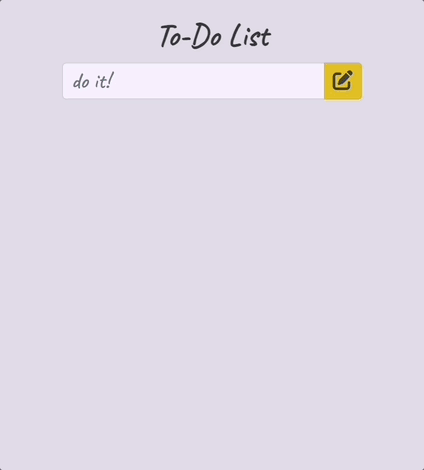

# SQL To-Do List

## Description

This to-do applicaton allows a user to enter tasks and store them in a SQL database. Tasks can be toggled between complete and incomplete and can also be deleted. When marked complete, the user sees the time the task was completed. 

## Demo

; 

### Prerequisites

- [Node.js](https://nodejs.org/en/)
- [Nodemon](https://www.npmjs.com/package/nodemon)
- [Express](http://expressjs.com/)
- [PostgreSQL](https://www.postgresql.org/)
- [Node-postgres](https://node-postgres.com/)
- [Postico](https://eggerapps.at/postico/)

### Installation

1. Create a database named `weekend_to_do_app` in Postico
2. Execute the queries from `database.sql` in Postico to create the `todo` table. 
3. Within your code editor, open a terminal window and run:
    - `npm install express`
    - `npm install pg`
4. Run `npm start` in the terminal and access the application at `localhost:5001` in your browser

## Usage

1. Enter a new task by typing its description in the `do it!` field and then clicking the gold pen button. The task will be added to the task list below with a yellow background. 
2. If a task was entered by mistake or no longer needed, click the salmon minus button. An alert will ask for confirmation before deleting. Click `OK` to delete or `Cancel` to keep.
3. Complete a task by clicking the teal circle button. Once clicked, the yellow background disappears. The teal button displays a checkmark and is disabled. The task descripton appears with a strike-through, and the time the task was completed is logged to the right. If a task was marked done in error, click the teal checkmark button again and it will display again as an imcomplete task. 
4. Tasks appear in order of whether they are complete, with incomplete tasks appearing first. If incomplete, they appear in order of when they were added. If complete, they appear in order of when they were completed. 
5. Tasks are stored in a database so the information entered is retained even when the server is restarted.

## Built With

Node.js | Express | Bootstrap | jQuery | PostgreSQL

## To-Done List

### Part 1: Set It Up
- [X] Set up file structure for application
- [X] Install Express and pg
- [X] Create initial layout including input field for index.html 
- [X] Source in jQuery, Bootstrap, Google Font, FontAwesome, SweetAlert
- [X] Spin up server
- [X] Make new database and create table query with needed data types in Postico. Test with sample data. 

### Part 2: Read-GET-SELECT
- [X] Make and test server GET route using router and SQL query SELECT
- [X] Make and test client AJAX request to GET records from database
- [X] Display tasks on page by looping over objects in array from server

### Part 3: Create-POST-INSERT INTO
- [X] Store values from input on click in task object
- [X] Make and test client AJAX request to POST object to database
- [X] Make and test server POST route using SQL query INSERT INTO
- [X] Call getTask to display revised database tasks on page

### Part 4: Delete-DELETE-DELETE!
- [X] Create delete button with data property to store id of task clicked on
- [X] Make and test client AJAX request to DELETE task from database using route parameter id
- [X] Make and test server DELETE route using SQL query DELETE and task id 
- [X] Call getTask to display revised database tasks on page

### Part 5: Update-PUT-UPDATE
- [X] Create complete button with data property to store id of task clicked on
- [X] Make and test client AJAX request to PUT task from database using route parameter id
- [X] Make and test server PUT route using SQL query UPDATE, completed column, id
- [X] Call getTask to display revised database tasks on page

### Part 6: Add Features
- [X] Bootstrap styling
    - Source in bootstrap to update buttons using button classes and input using form-control and input-group classes
    - Use media queries to to create breakpoints based on viewport widths
- [X] Delete confirmation
    - Source in SweetAlert to change standard alert format and ask for confirmation before a user deletes a task
- [X] Time completed
    - Create timestamp data columns in `todo` table for time task added and time task completed
    - Store date object when complete button clicked on. Send object with time completed property as part of AJAX PUT request
    - Update PUT route using SQL query UPDATE, completed column, time_completed column, id
    - Call getTask to display revised database tasks on page, now with completed time
- [X] Task ordering
    - Update server GET route and SQL query SELECT to include ORDER BY
    - Sort tasks by completed status, then time completed, then time added
    - Call getTask to display revised order of database tasks on page
